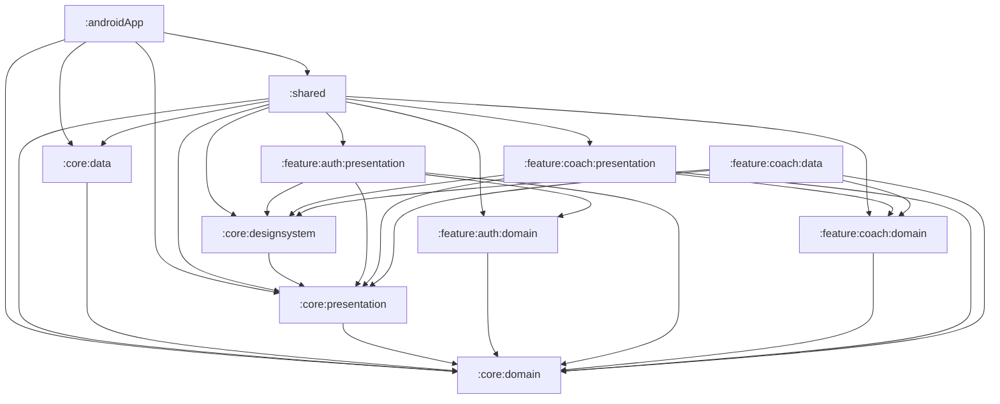

# Module Dependency Graph

```mermaid
graph TD
    androidApp[":androidApp"]
    shared[":shared"]
    core_data[":core:data"]
    core_domain[":core:domain"]
    core_presentation[":core:presentation"]
    core_designsystem[":core:designsystem"]
    auth_domain[":feature:auth:domain"]
    auth_presentation[":feature:auth:presentation"]
    coach_domain[":feature:coach:domain"]
    coach_presentation[":feature:coach:presentation"]
    coach_data[":feature:coach:data"]

    androidApp --> shared
    androidApp --> core_data
    androidApp --> core_presentation
    androidApp --> core_domain

    shared --> core_data
    shared --> core_domain
    shared --> core_presentation
    shared --> core_designsystem
    shared --> auth_domain
    shared --> auth_presentation
    shared --> coach_domain
    shared --> coach_presentation

    core_data --> core_domain
    core_presentation --> core_domain
    core_designsystem --> core_presentation

    auth_domain --> core_domain
    auth_presentation --> auth_domain
    auth_presentation --> core_domain
    auth_presentation --> core_designsystem
    auth_presentation --> core_presentation

    coach_domain --> core_domain
    coach_presentation --> coach_domain
    coach_presentation --> core_domain
    coach_presentation --> core_designsystem
    coach_presentation --> core_presentation
    coach_data --> coach_domain
    coach_data --> core_domain
    coach_data --> core_designsystem
    coach_data --> core_presentation
```
